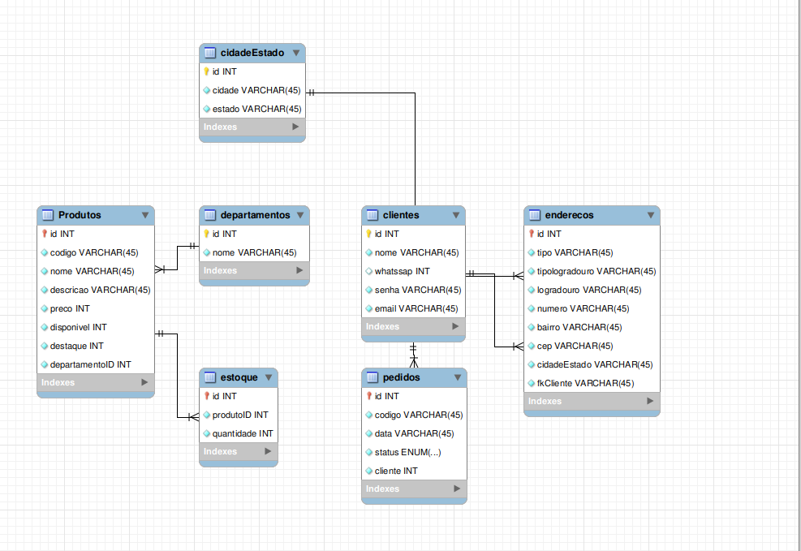

# DESAFIO 3

# Modelo entidade/Relacionamento



# CRIAÇÃO DO BANCO E TABELAS

<details>
<summary>Criação do banco de dados</summary>

```sql
CREATE SCHEMA `eccomerce-challenge` ;
```

</details>
<details>

<summary>Criação da tabela de departamentos</summary>

```sql
CREATE TABLE `departamentos` (
  `id` int NOT NULL AUTO_INCREMENT,
  `nome` varchar(45) NOT NULL,
  PRIMARY KEY (`id`)
) ENGINE=InnoDB AUTO_INCREMENT=4 DEFAULT CHARSET=utf8mb4 COLLATE=utf8mb4_0900_ai_ci;
```

</details>

<details>

<summary> Criação da tabela de produtos </summary>

```sql
CREATE TABLE `Produtos` (
  `id` int NOT NULL AUTO_INCREMENT,
  `codigo` varchar(45) NOT NULL,
  `nome` varchar(45) NOT NULL,
  `descricao` varchar(45) NOT NULL,
  `preco` int NOT NULL,
  `disponivel` enum('sim','não') NOT NULL,
  `destaque` enum('sim','não') NOT NULL,
  `departamentoID` int NOT NULL,
  KEY `departamentoID_idx` (`id`),
  CONSTRAINT `departamentoID` FOREIGN KEY (`id`) REFERENCES `departamentos` (`id`)
) ENGINE=InnoDB AUTO_INCREMENT=14 DEFAULT CHARSET=utf8mb4 COLLATE=utf8mb4_0900_ai_ci;
```

</details>
<details>

<summary> Criação da tabela de estoque </summary>

```sql
CREATE TABLE `estoque` (
  `id` int NOT NULL AUTO_INCREMENT,
  `produtoID` int NOT NULL,
  `quantidade` int NOT NULL,
  PRIMARY KEY (`id`),
  CONSTRAINT `produto` FOREIGN KEY (`id`) REFERENCES `Produtos` (`id`)
) ENGINE=InnoDB AUTO_INCREMENT=4 DEFAULT CHARSET=utf8mb4 COLLATE=utf8mb4_0900_ai_ci;
```

</details>

<details>

<summary> Criação da tabela de clientes </summary>

```sql
CREATE TABLE `clientes` (
  `id` int NOT NULL AUTO_INCREMENT,
  `nome` varchar(45) NOT NULL,
  `whatssap` int DEFAULT NULL,
  `senha` varchar(45) NOT NULL,
  `email` varchar(45) NOT NULL,
  PRIMARY KEY (`id`)
) ENGINE=InnoDB AUTO_INCREMENT=6 DEFAULT CHARSET=utf8mb4 COLLATE=utf8mb4_0900_ai_ci;
```

</details>

<details>

<summary> Criação da tabela de endereços </summary>

```sql
CREATE TABLE `enderecos` (
  `id` int NOT NULL AUTO_INCREMENT,
  `tipo` varchar(45) NOT NULL,
  `tipologradouro` varchar(45) NOT NULL,
  `logradouro` varchar(45) NOT NULL,
  `numero` varchar(45) NOT NULL,
  `bairro` varchar(45) NOT NULL,
  `cep` varchar(45) NOT NULL,
  `cidadeEstado` varchar(45) NOT NULL,
  `fkCliente` varchar(45) NOT NULL,
  PRIMARY KEY (`id`),
  CONSTRAINT `fkCidadeEstado` FOREIGN KEY (`id`) REFERENCES `cidadeEstado` (`id`),
  CONSTRAINT `fkCliente` FOREIGN KEY (`id`) REFERENCES `clientes` (`id`)
) ENGINE=InnoDB AUTO_INCREMENT=5 DEFAULT CHARSET=utf8mb4 COLLATE=utf8mb4_0900_ai_ci;
```

</details>

<details>

<summary>Criação da tabela cidadeEstados </summary>

```sql
CREATE TABLE `cidadeEstado` (
  `id` int NOT NULL AUTO_INCREMENT,
  `cidade` varchar(45) NOT NULL,
  `estado` varchar(45) NOT NULL,
  PRIMARY KEY (`id`)
) ENGINE=InnoDB AUTO_INCREMENT=5 DEFAULT CHARSET=utf8mb4 COLLATE=utf8mb4_0900_ai_ci;
```

</details>
<details>

<summary>Criação da tabela pedidos </summary>

```sql
CREATE TABLE `pedidos` (
  `id` int NOT NULL AUTO_INCREMENT,
  `codigo` int NOT NULL,
  `data` varchar(45) NOT NULL,
  `status` enum('novo-pedido','cancelado','aguardando-pagamento','pagamento-autorizado','pagamento-negado','em-separacao','em-transporte','entregue') NOT NULL,
  `cliente` int NOT NULL,
  PRIMARY KEY (`id`),
  KEY `codigo_idx` (`codigo`),
  CONSTRAINT `cliente` FOREIGN KEY (`id`) REFERENCES `clientes` (`id`),
  CONSTRAINT `codigo` FOREIGN KEY (`codigo`) REFERENCES `Produtos` (`id`)
) ENGINE=InnoDB AUTO_INCREMENT=4 DEFAULT CHARSET=utf8mb4 COLLATE=utf8mb4_0900_ai_ci;
```

</details>
# INSERÇÃO DE DADOS

<details>

<summary>Inserindo Departamentos </summary>

```sql
INSERT INTO `departamentos` VALUES (1,'informática'),(2,'limpeza'),(3,'acessórios');
```

</details>

<details>
<summary>Inserindo Produtos </summary>

```sql
INSERT INTO `Produtos` VALUES (1,'4','Computador','computador 4GB RAM',1500,'sim','não',1),
(2,'8','Shampoo','shampo monange',15,'sim','sim',2),
(3,'5','Nootbook','DELL ISPIRION',4000,'sim','sim',1),(4,'15','SAMSUNG A70', 'SMARTPHONE',3000,'sim','não',10);
```

</details>

<details>

<summary>Inserindo  Estoque </summary>

```sql
INSERT INTO `estoque` VALUES (1,8,8),(2,4,3),(3,5,30);
```

</details>

<details>

<summary>Inserindo  Clientes </summary>

```sql
INSERT INTO `clientes` VALUES (1,'welisson',9345258,'123','welisson@gmail.com'),
(2,'douglas',9854523,'145','douglas@gmail.com'),
(3,'marcelo',84452345,'321','marcelocarioca@gmail.com'),
(4,'mariana',9484848,'4444','mariana@gmail.com'),
(5,'carla',999999,'212131','carla@gmail.com');
```

</details>

<details>

<summary>Inserindo  Endereços </summary>

```sql
INSERT INTO `enderecos` VALUES (1,'rua','Onze','Guajára','100','Coqueiro','67145370','3','1'),
(2,'Residencial','Fit Coqueiro','Cidade nova 5','50','Coqueiro','657850','1','2'),
(3,'Residencial','Vitoria','Maguari','60','Campinas','45555','2','5'),
(4,'Rua','Olimpo','caxias','40','Caxias','774474','4','4');
```

</details>

<details>
<summary>Inserindo  Cidades e estados </summary>

```sql
INSERT INTO `cidadeEstado` VALUES (1,'Belém','Pará'),
(2,'Campinas','São Paulo'),
(3,'Ananindeua','Pará'),
(4,'Gramado','Rio grande do sul');
```

</details>

<details>

<summary>Inserindo  Pedidos </summary>

```sql
INSERT INTO `pedidos` VALUES (1,4,'20/5/2021','entregue',1),
(2,8,'21/05/2021','cancelado',3),
(3,5,'22/05/2021','aguardando-pagamento',4);
```

</details>

# Fazendo consultas no banco

<details>

<summary>
SELECIONANDO SOMA DE VALOR DE PRODUTOS POR CATEGORIA
</summary>

```sql
SELECT SUM(Produtos.preco), departamentos.nome
from Produtos
inner join departamentos
on Produtos.departamentoID = departamentos.id
group by departamentos.id;
```

</details>

<details>

<summary> SELECIONANDO QUANTIDADE DE PRODUTOS POR CATEGORIA</summary>

```sql
SELECT COUNT(Produtos.id), departamentos.nome
from Produtos
inner join departamentos
on Produtos.departamentoID = departamentos.id
group by departamentos.id;
```

</details>

<details>
<summary>SELECIONANDO SOMA DE PRECOS DE PRODUTOS EM DESTAQUE POR DEPARTAMENTO </summary>

```sql
SELECT departamentos.nome , SUM(Produtos.preco)
from Produtos
inner join departamentos
on Produtos.departamentoID = departamentos.id
where Produtos.destaque = 1
group by departamentos.nome;

```

</details>

<details>
<summary>SELECIONANDO PEDIDOS DE UM CLIENTE ESPECIFICO </summary>

```sql
select clientes.nome, Produtos.descricao, pedidos.codigo from pedidos
inner join clientes on pedidos.cliente = clientes.id
inner join Produtos on pedidos.codigo = Produtos.codigo
where cliente = 3
```

</details>

<details>

<summary>SOMANDO TOTAL DE PEDIDOS DE UM CLIENTE </summary>

```sql
select clientes.nome, Produtos.descricao, COUNT(pedidos.codigo) from pedidos
inner join clientes on pedidos.cliente = clientes.id
inner join Produtos on pedidos.codigo = Produtos.codigo
where cliente = 3
```

</details>
